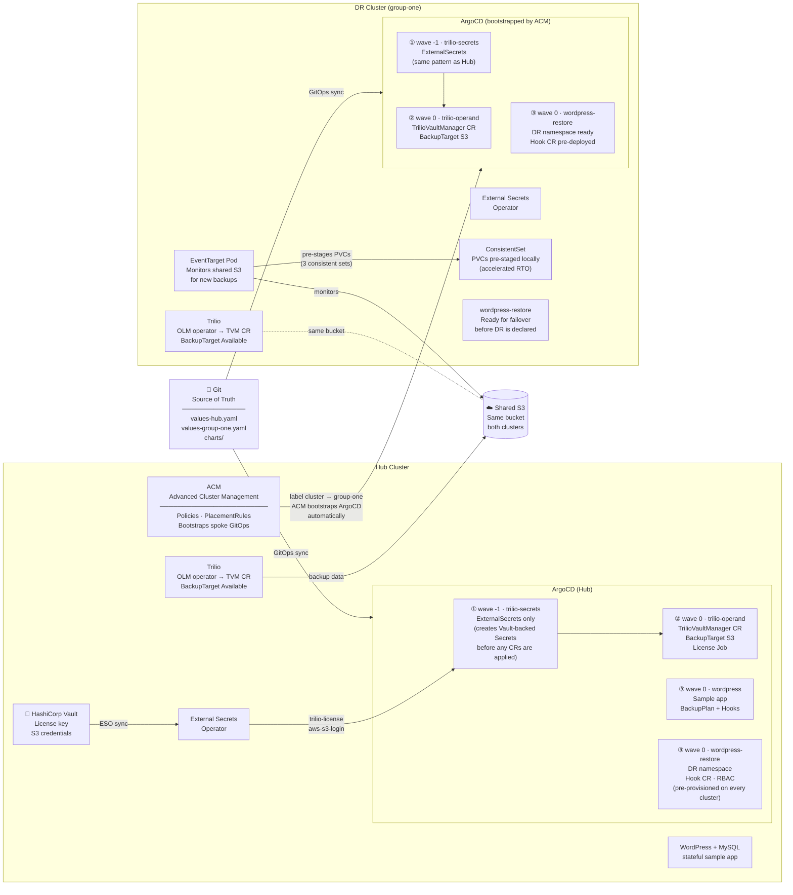
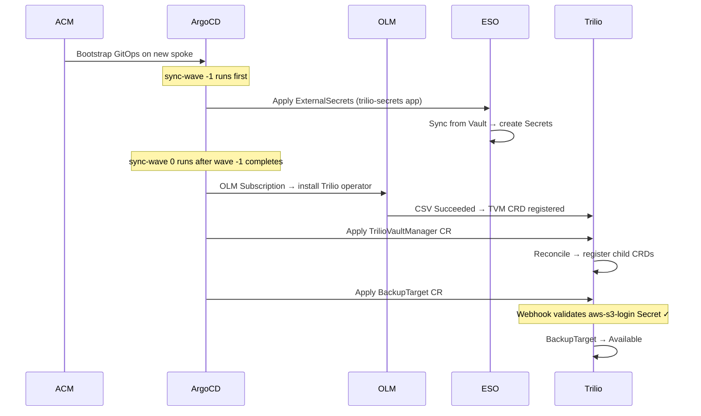
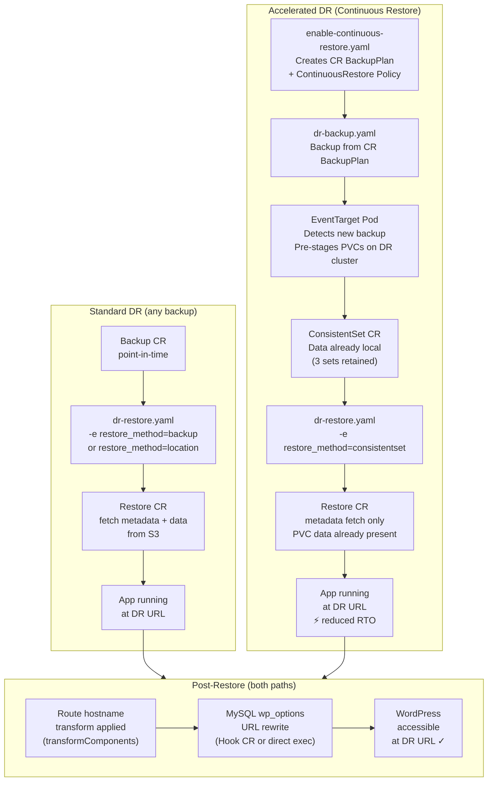
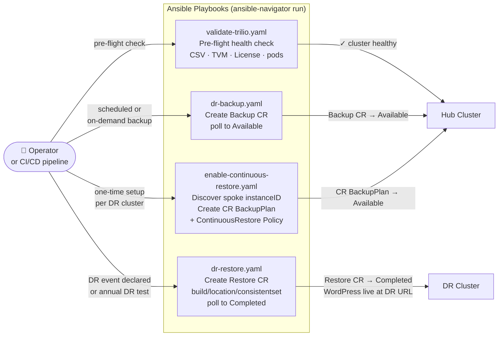

# Disaster Recovery with Trilio — Pattern Overview

A Red Hat Validated Pattern that delivers fully automated, GitOps-driven Disaster Recovery for
OpenShift using [Trilio for Kubernetes](https://docs.trilio.io/kubernetes/).

---

## What This Pattern Delivers

| Capability | How |
|------------|-----|
| Trilio deployed and licensed across all clusters | OLM operators + Helm operands via ArgoCD |
| Secrets never in Git | HashiCorp Vault → External Secrets Operator → Kubernetes Secrets |
| New DR cluster onboards automatically | ACM bootstraps ArgoCD; sync-waves sequence the deployment |
| Sample stateful app (WordPress + MySQL) protected | BackupPlan with quiesce/unquiesce hooks |
| Standard DR restore | `dr-restore.yaml` playbook — backup or location browse methods |
| Accelerated DR restore (reduced RTO) | Continuous Restore — Trilio pre-stages PVCs on the DR cluster |
| Runnable DR Test | Single `ansible-navigator run` command; no manual prep required |

---

## Cluster Architecture

---

## Deployment Sequencing (Sync Waves)

The sync-wave split solves a bootstrap ordering problem: Trilio's admission webhook requires
credential Secrets to exist before it will accept a BackupTarget CR. The wave -1 application
creates those Secrets first; wave 0 is guaranteed to find them ready.

---

## DR Workflow

Two restore paths are available. Both are driven by the same `dr-restore.yaml` playbook.

---

## Where Ansible Fits

Ansible handles all **imperative operations** — things that are triggered by a human decision
(DR test, annual exercise, on-demand backup) rather than Git state.

---

## Key Design Decisions

| Decision | Rationale |
|----------|-----------|
| OLM for operators, Helm for operands | OpenShift best practice; OLM manages upgrades and RBAC |
| Secrets via Vault → ESO, never in Git | Credentials rotate in Vault; all clusters pick them up automatically |
| Sync-wave split (trilio-secrets / trilio-operand) | Trilio admission webhook requires credential Secrets before BackupTarget is accepted |
| CR BackupPlan is Ansible-owned (not ArgoCD-managed) | Requires runtime-discovered spoke instanceID — same accepted pattern as the License Job |
| Post-restore URL rewrite via direct exec (ConsistentSet path) | Hook CR support for ConsistentSet restores is a planned enhancement (Req 7a) |
| `wordpress-restore` namespace pre-provisioned on all clusters | No manual prep required when DR is declared; namespace and Hook CR already exist |
