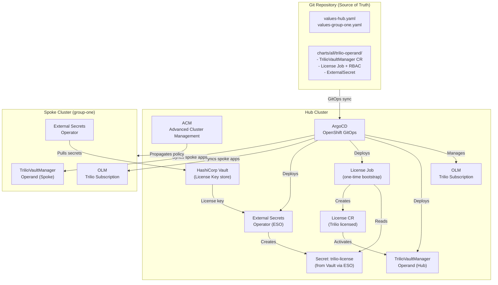

# Red Hat Validated Pattern: Disaster Recovery with Trilio

[](https://opensource.org/licenses/Apache-2.0)

A GitOps-driven Disaster Recovery solution for OpenShift using [Trilio for Kubernetes](https://docs.trilio.io/kubernetes/), built on the [Red Hat Validated Patterns](https://validatedpatterns.io/) framework.

## Overview

This pattern automates the full lifecycle of Trilio DR capabilities across OpenShift clusters:

- **Operator installation** via OLM (Operator Lifecycle Manager)
- **Operand deployment** (TrilioVaultManager CR) via Helm
- **License management** via HashiCorp Vault + External Secrets Operator
- **Continuous delivery** via ArgoCD / OpenShift GitOps
- **Validation** via Ansible playbooks

## Architecture



### Component Roles

| Component | Role |
|-----------|------|
| **OLM Subscription** | Installs `k8s-triliovault` operator from certified-operators catalog |
| **TrilioVaultManager CR** | Operand that configures Trilio data protection services |
| **ExternalSecret** | Pulls Trilio license key from Vault path `secret/global/trilio-license` |
| **License Job** | One-time bootstrap Job that creates the `License` CR from the ESO-managed Secret |
| **ArgoCD** | Continuous delivery — syncs all Helm charts to hub and spoke clusters |
| **ACM** | Manages spoke cluster membership and propagates subscriptions |

## Prerequisites

- OpenShift 4.x (hub + optional spoke clusters)
- OpenShift GitOps (ArgoCD) installed on hub
- Advanced Cluster Management (ACM) installed on hub
- HashiCorp Vault accessible from the cluster
- External Secrets Operator deployed
- Validated Patterns operator installed on the hub cluster

## Deployment

There are two supported approaches. Both result in the same running pattern — the difference is only in how secrets are loaded into Vault.

### Option A — VP Operator + manual Vault secrets (recommended)

The VP operator on the hub cluster watches the Git repo and reconciles the pattern automatically.

**1. Add this repo to the VP operator**

In the OpenShift console, navigate to the Validated Patterns operator and create a Pattern CR pointing at this repository.

**2. Write secrets to Vault**

```bash
# Write Trilio license key (must be a single unbroken line — no backslashes)
oc exec -n vault vault-0 -- env VAULT_TOKEN=$VAULT_TOKEN \
  vault kv put secret/global/trilio-license key="<your-license-key>"

# Write S3 credentials
oc exec -n vault vault-0 -- env VAULT_TOKEN=$VAULT_TOKEN \
  vault kv put secret/global/trilio-s3 \
  accessKey="<access-key>" secretKey="<secret-key>"
```

ArgoCD takes over from there — installs the Trilio operator, deploys the TVM operand, and creates the License CR.

---

### Option B — make install (Ansible-driven)

Requires the `rhvp.cluster_utils` Ansible collection. Two ways to get it:

- **Local install** (currently pre-release on Galaxy):
  ```bash
  ansible-galaxy collection install rhvp.cluster_utils --pre
  ```
- **VP utility container** (requires `podman`, collection pre-installed):
  ```bash
  ./pattern.sh make install
  ```

Populate `values-secret.yaml` from the template:

```bash
cp values-secret.yaml.template values-secret.yaml
# Fill in trilio-license key, S3 accessKey and secretKey
make install        # or: ./pattern.sh make install
```

`make install` writes secrets to Vault and registers the ValidatedPattern CR. ArgoCD takes over from there.

---

### 3. Validate

```bash
# Check Trilio operator
oc get csv -n trilio-system | grep trilio

# Check TrilioVaultManager
oc get triliovaultmanager -n trilio-system

# Check License CR
oc get license -n trilio-system

# Run Ansible validation
ansible-playbook ansible/playbooks/validate-trilio.yaml
```

## DR Workflows

### Backup a namespace

```bash
ansible-playbook ansible/playbooks/dr-backup.yaml \
  -e target_namespace=my-app \
  -e backup_name=my-app-backup-01 \
  -e s3_target=my-s3-target
```

### Restore from a backup

```bash
ansible-playbook ansible/playbooks/dr-restore.yaml \
  -e source_backup=my-app-backup-01 \
  -e restore_name=my-app-restore-01 \
  -e restore_namespace=my-app
```

See [ansible/playbooks/](ansible/playbooks/) for full playbook documentation.

## Repository Structure

```
.
├── charts/all/trilio-operand/     # Helm chart: TVM CR, License Job, RBAC, ExternalSecret
├── ansible/
│   ├── site.yaml                  # RHPDS bootstrap playbook
│   └── playbooks/
│       ├── validate-trilio.yaml   # Validates Trilio operator, TVM, and license
│       ├── dr-backup.yaml         # Creates BackupPlan + triggers Backup CR
│       └── dr-restore.yaml        # Triggers Restore CR from a given Backup
├── values-hub.yaml                # Hub cluster: subscriptions, applications, namespaces
├── values-group-one.yaml          # Spoke cluster: subscriptions, applications
├── values-global.yaml             # Global defaults
├── values-secret.yaml.template    # Secret management template
├── overrides/                     # Cloud-provider overrides (AWS, IBMCloud)
├── tests/interop/                 # Pytest integration tests
├── PRD.md                         # Product Requirements Document
├── Divergence.md                  # PRD vs implementation gap tracker
└── Learnings.md                   # Key insights and best practices
```

## Troubleshooting

### Trilio operator not installing

**Symptom**: `oc get csv -n trilio-system` returns nothing or shows `Pending`.

**Check**:
```bash
oc get subscription k8s-triliovault -n trilio-system -o yaml
oc get installplan -n trilio-system
oc get events -n trilio-system --sort-by='.lastTimestamp'
```

**Common causes**:
- `certified-operators` CatalogSource is not healthy: `oc get catalogsource -n openshift-marketplace`
- OperatorGroup missing or misconfigured: `oc get operatorgroup -n trilio-system`
- The namespace needs `operatorGroup: true` in `values-hub.yaml` / `values-group-one.yaml`

---

### TrilioVaultManager stuck in `Reconciling`

**Symptom**: `oc get triliovaultmanager -n trilio-system` shows status `Reconciling` indefinitely.

**Check**:
```bash
oc describe triliovaultmanager triliovault-manager -n trilio-system
oc logs -l app=k8s-triliovault -n trilio-system --tail=50
```

**Common causes**:
- License CR is missing or invalid — see License section below
- Insufficient cluster resources for `dataJobResources` / `metadataJobResources`
- Ingress controller conflicts — chart disables it by default (`ingress-controller.enabled: false`)

---

### License CR not created

**Symptom**: `oc get license -n trilio-system` returns nothing. TVM shows unlicensed.

**Diagnosis flow**:
```bash
# 1. Check the ExternalSecret synced the Secret
oc get externalsecret trilio-license -n trilio-system -o jsonpath='{.status.conditions}'
oc get secret trilio-license -n trilio-system

# 2. Check the License Job ran
oc get job trilio-license-job -n trilio-system
oc logs job/trilio-license-job -n trilio-system

# 3. Check Vault connectivity
oc get clustersecretstore vault-backend -o yaml
```

**Common causes**:
- Vault is unreachable or the path `secret/global/trilio-license` does not exist
- The `ClusterSecretStore` named `vault-backend` is not Ready
- The License Job RBAC is missing — ensure the `Role` and `RoleBinding` are deployed

---

### ArgoCD application out of sync

**Symptom**: `trilio-operand` application shows `OutOfSync` in ArgoCD UI.

**Check**:
```bash
oc get application trilio-operand -n openshift-gitops -o yaml | grep -A10 status
```

**Common causes**:
- Helm template rendering error (check Events tab in ArgoCD UI)
- `values-group-one.yaml` `argoProject` mismatch — must be `trilio-operand`
- The Job has `ttlSecondsAfterFinished` not set, causing drift detection on completed Jobs

---

### Backup fails to complete

**Symptom**: `oc get backup -n my-app` shows `Failed` or stays in `InProgress`.

**Check**:
```bash
oc describe backup <backup-name> -n my-app
oc logs -l triliovault.trilio.io/component=data-mover -n trilio-system --tail=100
```

**Common causes**:
- S3 target unreachable or credentials invalid
- PVC is not bound or CSI driver not supported
- BackupPlan references a Target that is not in `Available` status: `oc get target -n trilio-system`

## References

- [Red Hat Validated Patterns](https://validatedpatterns.io/)
- [Trilio for Kubernetes Documentation](https://docs.trilio.io/kubernetes/)
- [External Secrets Operator](https://external-secrets.io/)
- [OLM Operator Lifecycle Manager](https://olm.operatorframework.io/)
